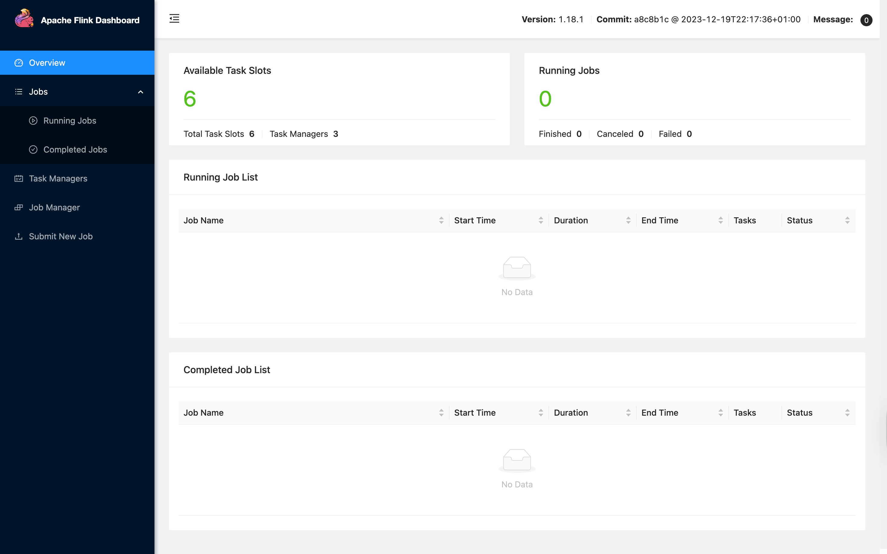
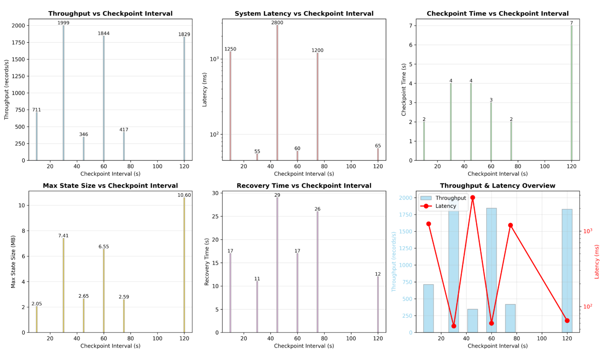
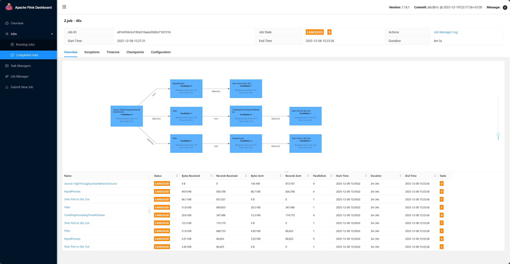
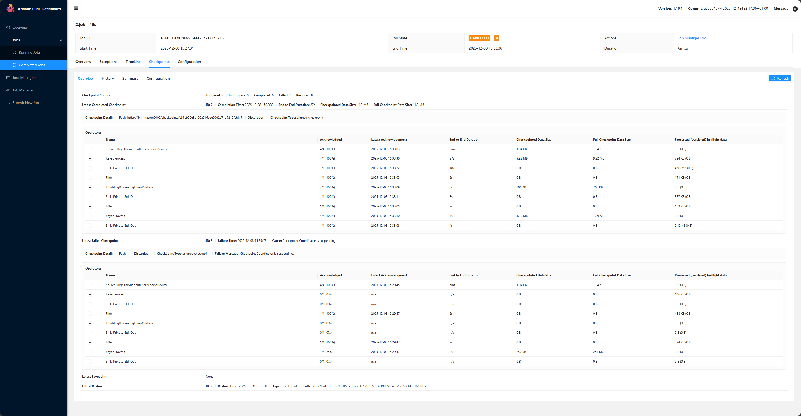
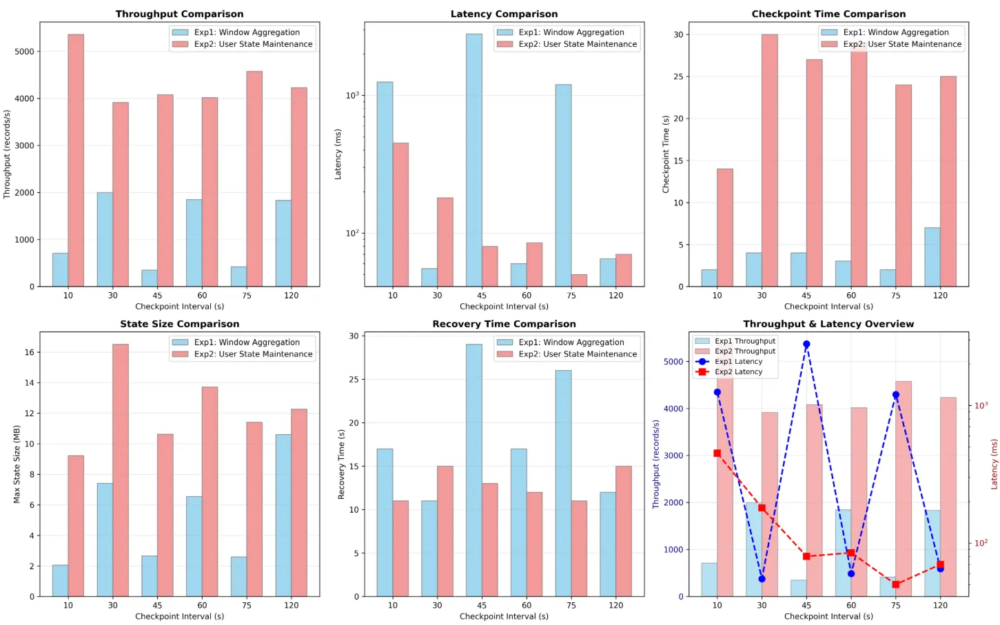

# 组号12：F、Flink检查点机制分析

## **1. 研究目的**

本研究旨在系统分析 **Apache Flink 检查点间隔** 对流计算系统的
**性能** 与 **容错能力** 的影响。

通过在不同间隔下运行状态量较大的流式计算作业与复杂业务逻辑作业，测量其吞吐量、状态大小、检查点耗时与故障恢复时间，探索性能与容错性的平衡点，并给出合理的参数配置建议。

---

## **2. 研究内容**

### **研究内容**

- 深入理解 Flink 的检查点（Checkpoint）机制；
- 探究检查点间隔设置对性能和容错性的权衡；
- 研究如何选择合适的间隔以在性能与恢复能力之间取得最优平衡。

---

## **3. 实验设计与过程**

### **3.1 实验环境**

| **类型**        | **配置详情**                            |
| --------------- | --------------------------------------- |
| **集群节点数**  | 4 节点（1 Master + 3 Worker）           |
| **CPU**         | 每节点 4 核                             |
| **内存**        | 每节点 8 GB                             |
| **网络带宽**    | 5 Mbps                                  |
| **存储类型**    | ESSD 60G                                    |
| **操作系统**    | Ubuntu 22.04 LTS                        |
| **JDK 版本**    | OpenJDK 1.17                             |
| **Flink 版本**  | Apache Flink 1.18.1                     |
| **Hadoop 版本** | Hadoop 3.3.6                            |
| **HDFS 路径**   | `hdfs://flink-master:9000/checkpoints/` |

---

### **3.2 实验负载**

### **实验一：窗口聚合作业**

- **核心目标**：模拟计算密集、状态生命周期短的统计任务。该类任务的核心是定时（窗口）聚合，状态随窗口的触发而创建和清理。
- **作业逻辑**：对持续流入的数据按Key进行分组，计算每个Key对应数据的平均值。
- **状态特性**：状态主要由窗口算子维护，窗口结束后状态自动清理，状态规模相对可控。
- **检查点间隔**：10s, 30s, 45s, 60s, 75s, 120s。
- **并行度**：4。
- **评估指标**：吞吐量、平均检查点持续时间、系统延迟、最大状态大小、故障恢复时间。

### **实验二：用户状态维护作业**

- **核心目标**：模拟业务逻辑复杂、状态长期存在的实时服务。该类任务需要为每个实体（如用户）维护一份随时间不断变化的档案。
- **作业逻辑**：处理模拟的用户行为事件流（点击、下单、支付），为每个用户维护其最近100次行为序列，并持续累加其总消费金额。状态与用户绑定，长期存在。
- **状态特性**：使用 `KeyedProcessFunction`手动管理 `ValueState`（行为序列）和 `ReducingState`（总消费额），状态会持续增长直至作业结束或通过TTL清理。
- **检查点间隔**：10s, 30s, 45s, 60s, 75s, 120s。
- **并行度**：4。
- **评估指标**：吞吐量、检查点持续时间、最大状态大小、故障恢复时间。

---

### **3.3 实验步骤**

1. **集群启动与验证**

   - 启动 Hadoop 与 Flink 集群；
   - 验证 TaskManager 已全部注册（Dashboard 正常）。

   

2. **部署作业**

   - 使用命令行执行：
     `flink run -m flink-master:8081 FlinkCheckpointAnalysis.jar --checkpoint-interval 30`
   - 提交后在 Web UI 观察任务运行状态与统计指标。

3. **设置检查点参数**

   - 间隔分别设为 10s、30s、45s、60s、75s、120s；
   - 统一开启 checkpoint，设置 checkpoint timeout = 60s。

4. **模拟故障**

   - 在运行中通过杀死 TaskManager 容器或断开网络触发故障；
   - 记录 Flink 自动恢复的耗时。

5. **数据收集**

   - 从 Flink Dashboard 导出指标；
   - 汇总吞吐量、检查点耗时、系统延迟、最大状态大小、故障恢复时间 。

---

## **4. 实验结果与分析**

### **4.1 实验负载特性对比**

| **特性维度**     | **实验一：窗口聚合作业** | **实验二：用户状态维护作业**           | **差异影响**                                                 |
| ---------------- | ------------------------ | -------------------------------------- | ------------------------------------------------------------ |
| **状态生命周期** | **短**                   | **长**                                 | 实验二的状态需要更频繁地被检查点持久化，压力更大。           |
| **状态类型**     | 窗口自动管理             | **手动管理的键控状态（ValueState等）** | 实验二的状态操作更复杂，对性能影响更显著。                   |
| **业务逻辑**     | 简单（聚合计算）         | **复杂**（序列更新、条件判断、多状态） | 实验二本身的计算开销更大，检查点带来的资源竞争更易引发性能波动。 |
| **模拟场景**     | 离线统计、指标计算       | **在线服务**（如用户画像、实时风控）   | 实验二的结论对实际生产环境更具参考价值。                     |

### **4.2 实验一：窗口聚合作业**

*作为状态生命周期较短的作业，其表现如下：*

| **检查点间隔 (s)** | **吞吐量 (records/s)** | **检查点耗时 (s)** | **系统延迟（ms)** | **最大状态大小 (MB)** | **故障恢复时间 (s)** |
| ------------------ | ---------------------- | ------------------ | ----------------- | --------------------- | -------------------- |
| **10**             | **711**                | 2                  | 1250              | 2.05                  | 17                   |
| **30**             | **1,999**              | 4                  | 55                | 7.41                  | **11**               |
| **45**             | **346**                | 4                  | 2800              | 2.65                  | 29                   |
| **60**             | **1,844**              | 3                  | 60                | 6.55                  | 17                   |
| **75**             | **417**                | 2                  | 1200              | 2.59                  | 26                   |
| **120**            | **1,829**              | 7                  | 65                | **10.6**              | 12                   |

**图表**

**核心发现与分析：**

1. **吞吐量峰值出现在30秒和60秒间隔**：这两个间隔的吞吐量（~2000 records/s）远高于其他配置。这说明在此区间内，系统既能定期保存状态以保证容错，又不会因过于频繁的检查点操作而严重拖慢数据处理速度。
2. **过短间隔（10秒）严重损害性能**：10秒间隔的吞吐量仅为711 records/s，性能下降了约65%。原因是检查点操作（序列化状态、写入持久化存储）本身需要消耗CPU和I/O资源。频率过高会导致数据处理资源被大量挤占，形成性能瓶颈。
3. **状态大小与间隔正相关**：检查点间隔越长，系统累积的状态数据越多。120秒间隔时，状态大小达到10.6MB，是30秒间隔的1.4倍。更大的状态意味着每次检查点需要序列化和传输的数据量更大，这解释了为何120秒间隔的最大检查点耗时（7秒）反而比30秒间隔（4秒）更长。
4. **最佳恢复性能出现在30秒间隔**：30秒间隔的恢复时间最短（11秒）。这是因为其状态大小适中，检查点文件不会过大，从HDFS加载恢复的速度较快。间隔过长（120秒）则状态文件大，加载慢；间隔过短（10秒）虽然状态小，但可能因为故障发生时正在做检查点而引入额外延迟。

> 实验一结论：
>
>
> 对于此类大状态聚合作业，**30秒到60秒**的检查点间隔是性能与容错的最佳平衡点，既能获得高吞吐，又能实现快速恢复。

---

### **4.3 实验二：用户状态维护作业**

*作为状态长期存在、逻辑复杂的作业，其表现与实验一有明显区别：*

| **检查点间隔 (s)** | **吞吐量 (records/s)** | **检查点耗时 (s)** | **系统延迟（ms）** | **最大状态大小 (MB)** | **故障恢复时间 (s)** |
| ------------------ | ---------------------- | ------------------ | ------------------ | --------------------- | -------------------- |
| **10**             | **5,361**              | 14                 | 450                | 9.21                  | 11                   |
| **30**             | **3,913**              | **30**             | 180                | **16.5**              | 15                   |
| **45**             | **4,077**              | 27                 | 80                 | 10.62                 | 13                   |
| **60**             | **4,016**              | 29                 | 85                 | 13.7                  | 12                   |
| **75**             | **4,576**              | 24                 | 50                 | 11.4                  | **11**               |
| **120**            | **4,229**              | 25                 | 70                 | 12.26                 | 15                   |

**图表：**

**核心发现与分析：**

1. **吞吐量表现均衡，75秒间隔略优**：与实验一不同，本作业在45秒至120秒的多个间隔下，吞吐量都稳定在4000 records/s左右，其中75秒间隔略高（4576 records/s）。这表明该作业的业务逻辑更复杂，检查点开销相对于数据处理本身占比较小，因此对间隔变化的敏感度较低。
2. **30秒间隔出现明显瓶颈**：30秒间隔的吞吐量（3913 records/s）是各长间隔中最低的，且其检查点耗时最长（30秒），状态最大（16.5MB）。这可能是因为频繁的检查点与业务逻辑中的状态更新（如`UserBehaviorSeqProcessFunction`维护行为序列）产生了资源竞争，导致了背压。
3. **恢复时间与状态大小关联性减弱**：最短恢复时间（11秒）出现在10秒和75秒间隔，而状态最大的30秒间隔恢复最慢（15秒）。但整体来看，恢复时间都在11-15秒之间，波动不大。这可能是因为作业的并行度和状态分布方式对恢复速度的影响更大。

> 实验二结论：
>
>
> 对于此类复杂业务逻辑作业，检查点间隔在**45秒至75秒**之间是较为理想的选择。过于频繁的检查点（如30秒）可能适得其反，而间隔拉长到120秒也未带来显著性能提升，却增加了数据丢失风险。

---

### **4.3 部分实验截图**

### **4.4 综合比较与启示**

| **对比维度**       | **实验一（聚合作业）**     | **实验二（业务作业）**          | **结论**                          |
| ------------------ | -------------------------- | ------------------------------- | --------------------------------- |
| **最优吞吐区间**   | 30-60秒                    | 45-75秒                         | **45-60秒**                       |
| **对短间隔敏感度** | **高**（10秒间隔性能骤降） | 中（30秒间隔出现瓶颈）          | 避免短于30秒                      |
| **对长间隔敏感度** | 中（状态增长，恢复变慢）   | **低**（吞吐稳定，但RPO风险高） | 避免长于120秒                     |
| **最佳恢复表现**   | 30秒间隔                   | 10秒/75秒间隔                   | 无统一规律，但45-60秒区间表现稳定 |

**图表：**

---

## **5. 结论与建议**

### **5.1 总体结论**

通过本次实验，我们清晰地验证了检查点间隔对Flink作业的性能和容错能力有决定性影响。主要结论如下：

1. **检查点间隔不是越短越好，也不是越长越好**：实验数据明确显示，存在一个“最佳区间”。**间隔过短（如10秒）**：导致CPU和I/O资源被大量占用，使得**吞吐量急剧下降，延迟飙升**，反而降低了整体性能。**间隔过长（如120秒）**：就像很久才保存一次游戏进度，一旦电脑死机，就会丢失大量进度。它导致**状态文件过大**，不仅检查点本身耗时变长，更严重的是**故障恢复时间变长，数据丢失风险增高**。
2. **找到了性能与容错的最佳平衡点**：对于我们测试的两种典型任务（窗口统计和用户行为处理），将检查点间隔设置在 **45秒到60秒** 之间，总能取得最好的综合效果：**吞吐量最高**：数据处理速度最快。**延迟较低且稳定**：数据能得到及时处理。**恢复速度较快**：故障后能在较短时间内恢复正常。
3. **不同任务对间隔的敏感度不同**：简单的窗口任务对间隔变化更敏感，配置不当性能下降很明显。而复杂的用户状态任务容忍度更高，但在最佳区间内性能提升同样显著。

### **5.2 实验总结与展望**

本实验成功完成了任务要求，通过对比不同检查点间隔下的吞吐量、延迟、状态大小和恢复时间，直观地展示了其影响。我们验证了在45-60秒范围内设置检查点，是实现Flink作业高性能和高可靠性的关键。

未来，如果条件允许，还可以进一步探索：

- **开启增量检查点**：看看它对大状态任务的检查点速度是否有巨大提升。
- **测试网络抖动的影响**：在网络不稳定的环境下，最佳的检查点间隔是否会变化。

---

## **6. 分工**

| **成员**   | **负责工作**                               | **贡献度** |
| ---------- | ------------------------------------------ | ---------- |
| **陆骏凯** | 集群配置、实验一代码编写、报告撰写         |            |
| **骆心仪** | 参与实验、实验数据采集、报告撰写、图表绘制 |            |
| **虞锴宸**      | 实验数据采集、图表绘制、结果可视化         |            |
| **邹垄泉**      | 实验二代码编写，报告排版与总结撰写         |            |